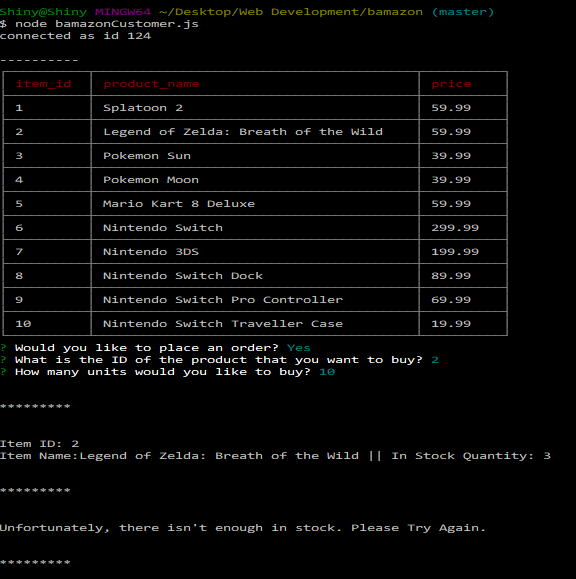
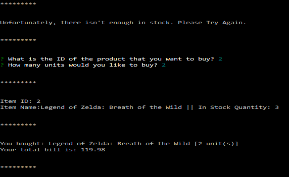
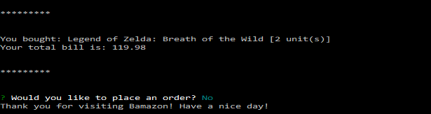

# Bamazon
*A CLI, Amazon-like Storefront created with Node.js and MySQL. The application will display all of the items available for sale, and customers will be able to place and order if there is enough of the item in stock. The data is stored in MySQL tables.*

## How to Use the APP

To purchase items, customers need to type `node bamazonCustomer.js`. Once typed, the customer will be shown a CLI-table of all the products up for sale. This table will provide the Product ID, the Product Name, and the Price. Afterwards, the customer will be asked if they would like to place an order. If 'yes' is chosen, the customer can choose which product they would like to choose (through the Product ID Number) and the amount of units they would like to purchase. If there is not enough, the customers will be told that there isn't enough in stock.

However, they will be prompted to try again. If there is enough, customers will be told that they bought the product. They are also told the number of units they bought, and the total bill.

After all of this, they are asked if they would like to purchase something again. If not, the connection ends.

- - -

## Technologies and Resources Used

This app was created with *Node.JS* and *MySQL*. The npm packages used were: *mysql*, *inquirer*, and  *cli-table*.

- - -

Copyright (c) 2017 Cassandra Villaruel
